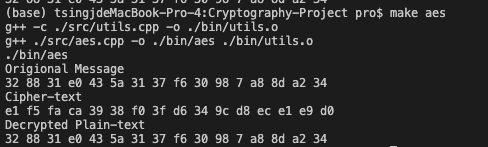
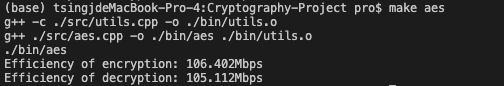
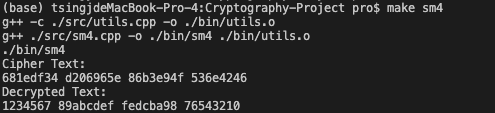
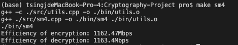
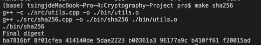
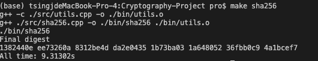
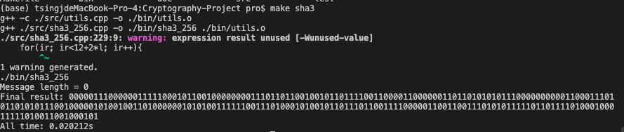
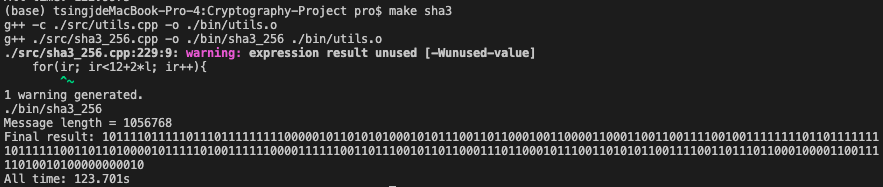
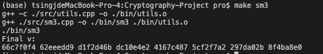
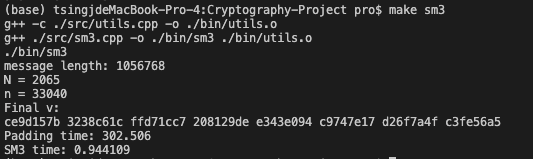

# 大作业报告
范晓昱 2020211336

## 加密算法

### 1. AES algorithm

AES算法源代码见``./src/aes.cpp``; 

**执行方式**：

* 效率测试：在主目录下运行``make aes``, 即执行随机生成1M数据并进行加解密。
* 正确性测试：添加``#define DEBUG``在aes代码文件开头，将执行测试样例，输出明文、加密后密文和解密后结果。

#### **加解密正确性说明**

  选取测试样例见：https://songlee24.github.io/2014/12/13/aes-encrypt/

  输出结果：

  

  可见明文和解密后密文一致，故算法正确; 同时在测试样例一致的key设置下，密文与测试样例一致.

#### **效率说明**
   按照效率测试执行，会计时加密时间和解密时间，用总数据量/时间，在程序中会自动计算加解密效率 

   

   *(注：为避免生成数据的时间影响，在CBC模式计算中逐轮记录加密时间和解密时间，最后求平均效率， 完整CBC模式测试可调用函数CBC_aes_files(), 会将加解密数据写文件到``./test/``文件夹中)*

### 2. SM4 algorithm

SM4 源代码见``./src/sm4.cpp``;

**执行方式**

* 效率测试：在主目录下运行``make sm4``, 即执行随机生成1M数据并进行加解密。
* 正确性测试：添加``#define DEBUG``在sm4代码文件开头，将执行测试样例，输出明文、加密后密文和解密后结果。

#### **加解密正确性说明**

  测试用国密文档中给出的测试样例，生成的密文一致，解密结果与明文一致.

  ```
  测试用数据和密钥：
  Word Key[Nk] = {0x01234567, 0x89ABCDEF, 0xFEDCBA98, 0x76543210};
  Word Messages[Nk] = {0x01234567, 0x89ABCDEF, 0xFEDCBA98, 0x76543210};
  ```

  加解密结果：

  

#### **效率说明**
    按照效率测试执行，会计时加密时间和解密时间，用总数据量/时间，在程序中会自动计算加解密效率 

   


## Hash 函数
### 1. SHA-256 hash function
SHA_256 哈希函数源代码见：``./src/sha256.cpp``;

**执行方式**

* 效率测试：在主目录下运行``make sha256``, 即执行随机生成1M数据并进行加解密。
* 正确性测试：添加``#define DEBUG``在sha256代码文件开头，将执行测试样例“abc”, 输出最终hash值。

### 测试样例
与NIPS文档测试样例“abc”和其最终结果一致。

测试：



### 效率测试
注释``#define DEBUG``后，运行``make sha256``,会读入``./tes/Message.txt``中生成的1M文件进行处理，输出最终digest和计时。

测试：



### 2. SHA3-256 hash function
SHA_256 哈希函数源代码见：``./src/sha3_256.cpp``;

**执行方式**

* 效率测试：在主目录下运行``make sha3``, 即执行随机生成1M数据并进行加解密。
* 正确性测试：添加``#define DEBUG``在sha3_256代码文件开头，将根据空输入进行计算。

### 测试样例
与NIPS文档测试样例空输入和其最终结果一致。

测试：



### 效率测试
注释``#define DEBUG``后，运行``make sha256``,会读入``./tes/Message.txt``中生成的1M文件进行处理，输出最终digest和计时。

测试：



### 3. SM3 hash function
SHA_256 哈希函数源代码见：``./src/sm3.cpp``;

**执行方式**

* 效率测试：在主目录下运行``make sm3``, 即执行随机生成1M数据并进行加解密。
* 正确性测试：添加``#define DEBUG``在sm3代码文件开头，将执行测试样例“011000010110001001100011”（国密文档中测试用例）, 输出最终hash值。

### 测试样例
与国密文档测试输出保持一致。

测试：



### 效率测试
注释``#define DEBUG``后，运行``make sm3``,会读入``./test/test.txt``中生成的1M文件进行处理，输出最终digest和计时(text.txt删除了换行符)。

测试：

